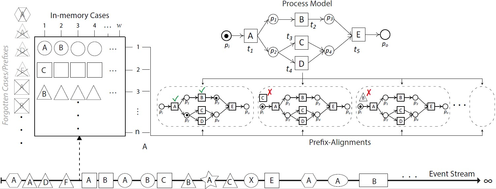

# Constrained-Data Online Conformance Checking

<p>
  <a href="https://www.sciencedirect.com/science/article/pii/S0306437923000649"></a>

</p>

Implementation of:

- [Conformance checking of process event streams with constraints on data retention](https://www.sciencedirect.com/science/article/pii/S0306437923000649). R Zaman, M Hassani, BF van Dongen - Information Systems, 2023

This prototype implementation is related to the Constrained-Data prefix-alignments based Online Conformance Checking (OCC) approaches. The proposed approach delimits the memory utilization in online conformance checking systems through: (i) frugally partially or fully forgetting cases, with or without retaining the state of the case, and (ii) recovering or predicting the previous state of the forgotten trace, respectively, and resuming the conformance computation.  




The provided prototype implementation is dependent on the prefix-alignments based [Online Conformance package](https://link.springer.com/content/pdf/10.1007/s41060-017-0078-6.pdf) which uses the A<sup>*</sup> algorithm for shortest path search based
prefix-alignment computation. This parent package requires a Petri net process model, its initial marking, and its final marking. Additionally, our approaches require the following additional input parameters:
- The Bounded Cases stateful approach requires a suitable case limit n.
- The bounded Cases and States, which is also a stateful approach, requires a state limit n in addition to a case limit n.
- The ML based Marking Prediction, a stateless approach, requires a feature size f and a case limit n.

## Installation
 - Download the code to your local machine.
 - If required, add the libraries provided as jar files, through Build Path.
 - Run the "ProM with UITopia (CDOCC).launch". Let the code to download all the required ProM packages on the first run.
 - Load your event log and the reference process model in the PROM environment and run one of the following plugin (the first two plugins belong to the stateful aproaches while the last two belong to the stateless approach):
 
    - "02_1 Compute Prefix Alignments Incrementally - With Bound on Traces".
    - "03_1 Compute Prefix Alignments Incrementally - With Bounds on States and Traces".
    - "05_2 Compute Prefix Alignments Incrementally - With Marking Prediction - 10Fold CV".
    - "05_1 Compute Prefix Alignments Incrementally - With Marking Prediction - Train Test Split"

 - Results are locally stored as csv files on the path provided in the parameters.


## Citation

If you use this code for your research, please consider citing our paper.

```bibtex
@article{ZAMAN2023102228,
title = {Conformance checking of process event streams with constraints on data retention},
journal = {Information Systems},
volume = {117},
pages = {102228},
year = {2023},
issn = {0306-4379},
doi = {https://doi.org/10.1016/j.is.2023.102228},
url = {https://www.sciencedirect.com/science/article/pii/S0306437923000649},
author = {Rashid Zaman and Marwan Hassani and Boudewijn F. {van Dongen}},
keywords = {Process mining, Event stream mining, Online conformance checking, Prefix alignments, Memory-aware conformance checking}
}
